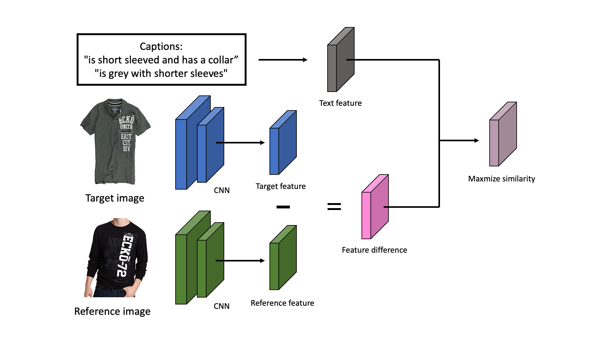

# Fashion Item Recommendation Methodology using CLIP Architecture

  

Summarized Our Approach for training. We encoded the reference image and the target image as features using CNN, and encoded the text using transformer. Then, we trained to maximize the similarity between the feature difference of images and feature of caption.
  
- CLIP-like model
- Fashion IQ dataset